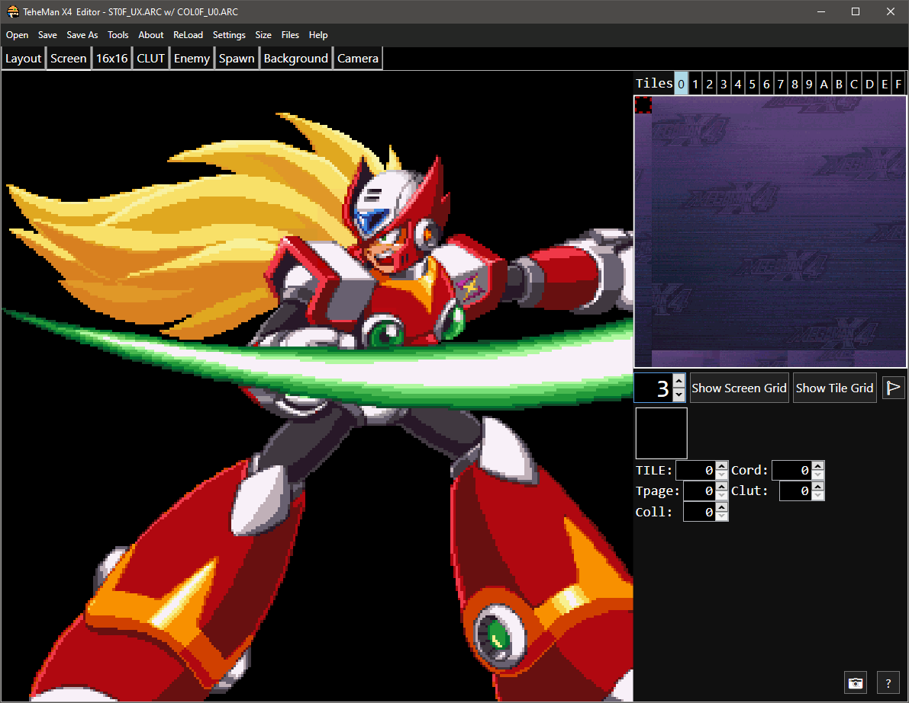
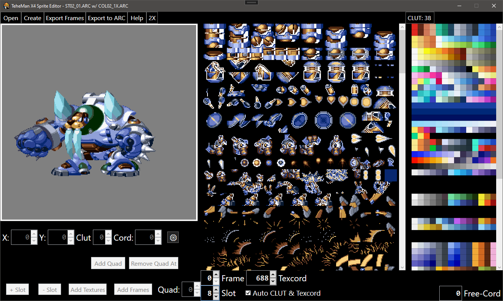
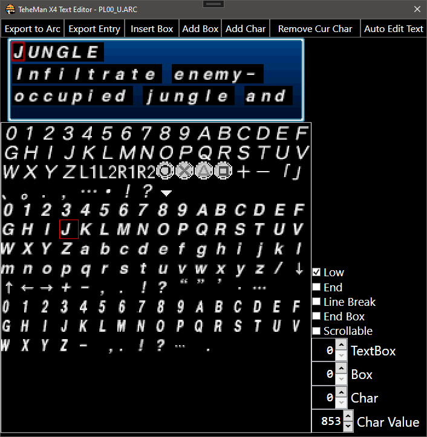

# TeheManX4 Editor
Level Editor for the PS1 Version of Mega Man X4 which comes packed 
with additional Tools to help with other aspects of the game as well some general purpose PS1 Tools

## Compiling
1st your gonna need Visaul Studio after cloning the repro. After installing Visual Studio use the Visual Studio Install App
to install the .NET Framework 4.7.2 SDK. Next , open the `TeheManX4_Editor.sln` via Visual Studio and set the default project to
`TeheMan X4 Editor` and Compile as `Release` then click Start. The EXE should be located in the `bin/Release` folder.

## Source Code
* [ARC.cs](TeheManX4/ARC.cs) - contains the class for importing and exporting the .ARC file type
* [Const.cs](TeheManX4/Const.cs) - contains Constants need by the program
* [Enemy.cs](TeheManX4/Enemy.cs) - the file containing classes for the enemies in EnemyTab (Enemy & EnemyCollection)
* [Entry.cs](TeheManX4/Entry.cs) - helping class for ARC.cs
* [Layout.cs](TeheManX4/Layout.cs) - contains the classes for saving the editors layout
* [Level.cs](TeheManX4/Level.cs) - a class representing a Level in the game
* [PSX.cs](TeheManX4/PSX.cs) - static class containning various functions and tools used through out the editor
* [Redux.cs](TeheManX4/Redux.cs) - static class contain the HTTP requests code for PCSX Redux's RESTful API
* [Settings.cs](TeheManX4/Settings.cs) - the file containning the Settings for the editor
* [Sprite.cs](TeheManX4/Sprite.cs) - a file that contains multiple classes needed by the Sprite Editor
* [TextEntry.cs](TeheManX4/TextEntry.cs) - the class used by the Text Editor to make importing + exporting text easier
* [Undo.cs](TeheManX4/Undo.cs) - the class representing an Undo
* [WriteFile.cs](TeheManX4/WriteFile.cs) - a class used by certain tools in PSX.cs
* [XA.cs](TeheManX4/XA.cs) - left overs , currently not used by editor

### [Config](TeheManX4/Config)
Basic config files that are mostly worth ignoring

### [Forms](TeheManX4/Forms)
A folder containning the the main xaml + C# code for all the tabs + windows

### [Resources](TeheManX4/Resources)
The folder containning various images , patches , styles that need for compiling